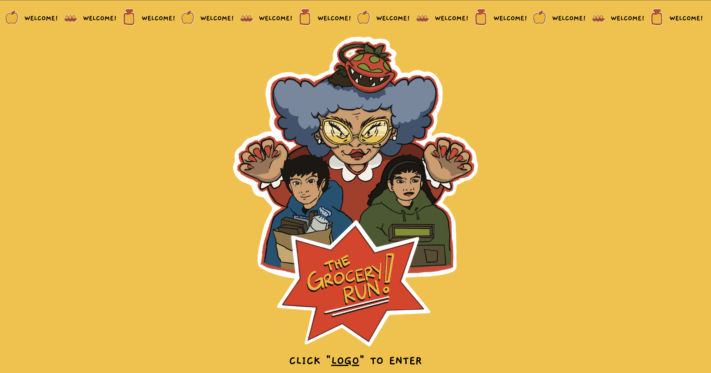

# The Grocery Run - Web Browser Game

## About

The Grocery Run is a web browser game inspired by the Google Dino Run. In this game, you control a character and your objective is to avoid obstacles, including "Angry Old Ladies," by jumping and performing small jumps. The game keeps track of your score, which increases the longer you survive. The game ends if your character collides with any obstacles. To restart the game, simply click the main logo.

**For the best user experience, play on a desktop with full-screen mode.**

This project is submitted by Franz Rhanico Domningo as part of the UNLV Web Development course in 2023.

## Original GitHub Repositories

I have created multiple repositories as rough drafts to help me stay organized during development:

- [GroceryRun-RoughDraft](https://github.com/rhanico/GroceryRun-RoughDraft.git)
- [theGroceryRun](https://github.com/rhanico/theGroceryRun.git)
- [theGroceryRun--roughdraft](https://github.com/rhanico/theGroceryRun--roughdraft.git)

## Acknowledgments

The JavaScript code for this game is based on [Kenny Yip Coding's YouTube tutorial](https://www.youtube.com/watch?v=lgck-txzp9o). You can find the original code in [Kenny Yip's GitHub repository](https://github.com/ImKennyYip/chrome-dinosaur-game.git).

## Sources

I used the following sources for reference and styling:

- [W3Schools](https://www.w3schools.com/css/default.asp) for CSS/HTML.
- [MDN Web Docs](https://developer.mozilla.org/en-US/docs/Web/CSS) for CSS/HTML.
- [TutorialsPoint](https://www.tutorialspoint.com/css/index.htm) for CSS.
- [Google Fonts](https://fonts.google.com) for fonts.

## Music and Sounds

- **Little Happiness** by Oneul. You can listen to it on [YouTube](https://www.youtube.com/watch?v=lRCGtI35VI0).

## Images and Illustrations

All images and illustrations used in the game were created by me.

## How to Play

1. Open the game in a web browser.
2. Use the **SPACE BAR** to jump over obstacles.
3. Use the **RIGHT ARROW** key for a small jump boost.
4. Avoid colliding with obstacles to keep your score increasing.
5. Click the main logo to restart the game.

Enjoy your Grocery Run adventure!
